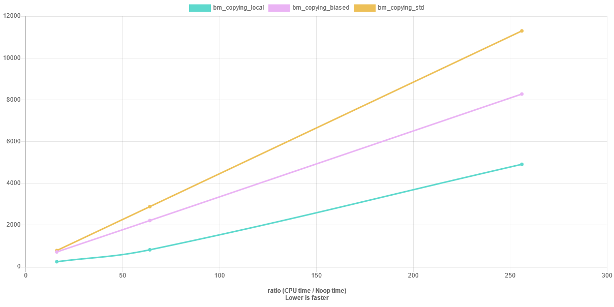
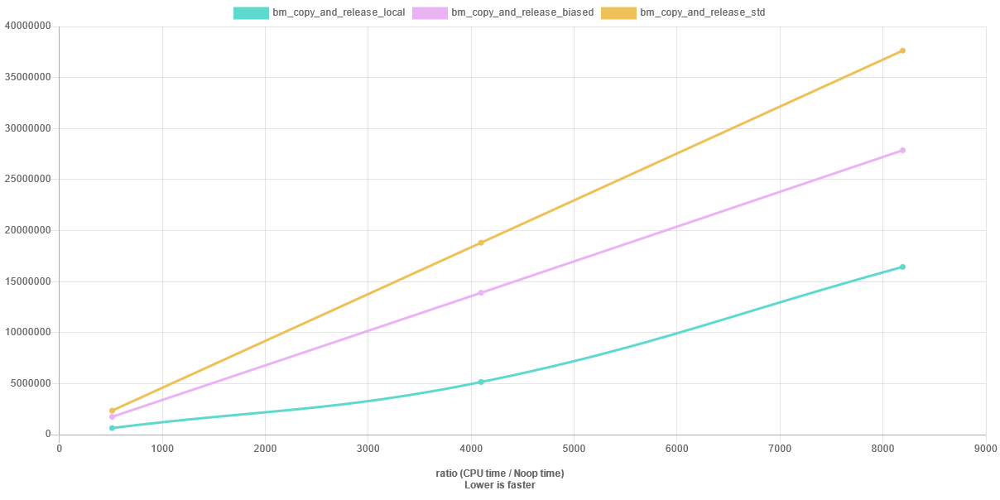
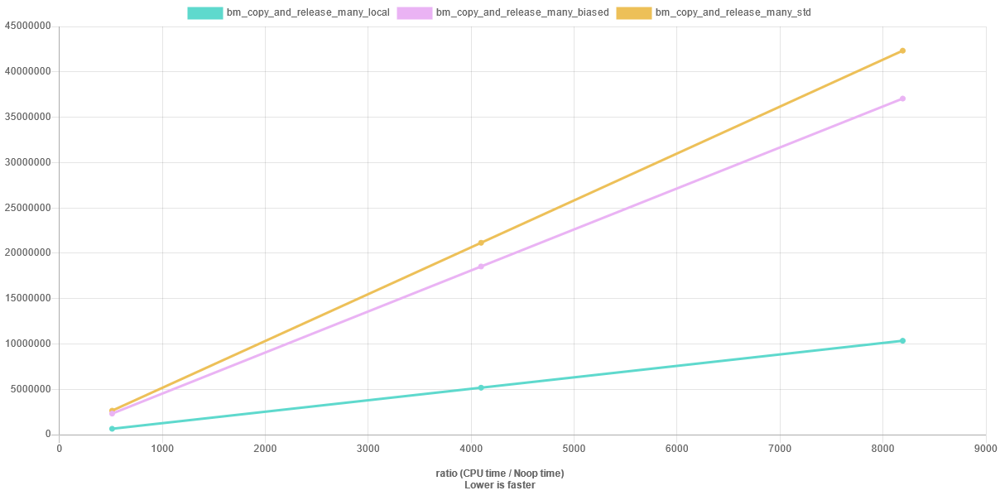
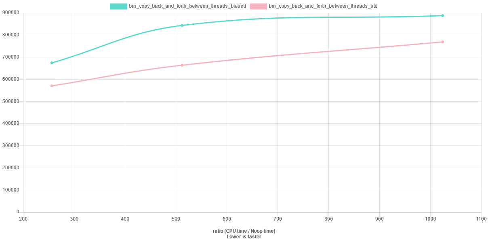

# shared_ptr

Experiments of different shared_ptr implementations. 

Currently there are two different implementations:

- A local not-thread safe `wind::local::shared_ptr`. Structure consist of the pointer to the data and an integer for reference counting.
- A "bias" thread safe `wind::bias::shared_ptr`. Structure consisting of the pointer to the data, an atomic counter for number of threads with copies, and a thread-local counter for number of copies in a thread. This implementation requires support for pthreads.


## Experiments:

Hypothesis:

- If you do not need thread safety, then `local::shared_ptr` is faster than the alternatives
- If you share amongst threads and each thread has multiple copies of the ptr then `bias::shared_ptr` is faster.
- If you have a lot of threads and each thread only has one(or a few) copies then `std::shared_ptr` is the fastest. 


All of the experiments have been run on https://www.quick-bench.com and using the `benchmark/source/shared_ptr_benchmark.cpp`. I do not own a pthread supporting system as of writing and therefore I would appreciate any feedback on the benchmarks.

Some benchmark graphs from quickbench - the names of the series corrospond to the specific benchmark:






# Building and installing

See the [BUILDING](BUILDING.md) document.

But in short:
```sh
cmake --preset=dev
cmake --build --preset=dev
ctest --preset=dev
```

# Consuming

Use [CPM.cmake](https://github.com/cpm-cmake/CPM.cmake)

```
CPMAddPackage(
  NAME benchmark
  GITHUB_REPOSITORY anders-wind/shared_ptr
)
```
This creates the cmake target: `wind::shared_ptr` which you can add in your `target_link_libraries`. Then you can add `include <shared_ptr/bias_shared_ptr.hpp>` or `include <shared_ptr/local_shared_ptr.hpp>`

# Contributing

See the [CONTRIBUTING](CONTRIBUTING.md) document.

# Licensing

See the [LICENSE](LICENSE) document.
